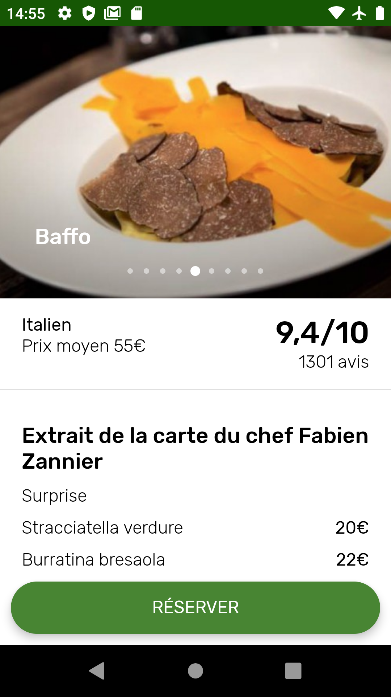

# ForkChallenge  

Technical test whose main goal was to mimic an old restaurant view of the [Android "The Fork" application](https://play.google.com/store/apps/details?id=com.lafourchette.lafourchette&hl=en).

End result:

  

 ## Architecture
The app rely on the Clean Architecture principles with three seperate modules:

 - app[*Android*]: Handles the UI using the *MVVM*, *Data Binding* & *Live Data* objects
 - data[*Android*]: Retrieve data from the restaurant API through interface set from the domain module using the Retrofit & GSON libraries
 - domain[*Kotlin*]: Contains entities, repositories & use cases. Uses Coroutines for background requests
 
 ## Setup
Add your API key in a file named keys.properties in the root folder

    echo "THE_FORK_API_KEY = XXX" > keys.properties

### TODO:
 - State handling in the details view *(i.e loading, errors)*
 - Unit testing
 - Offline support
